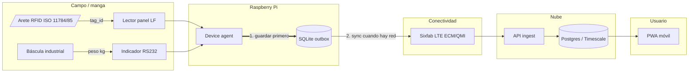
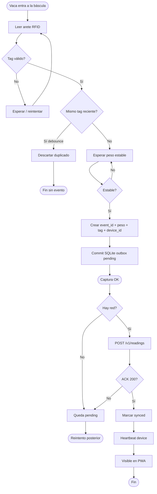
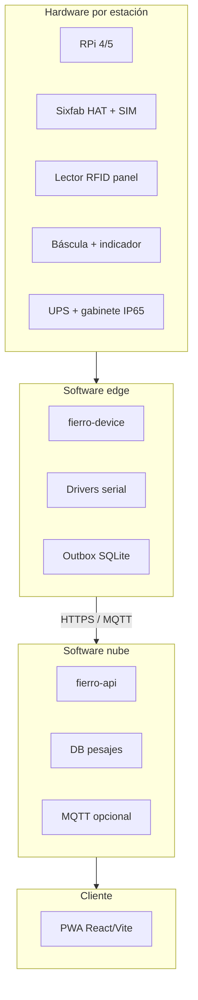

# Diagrama de bloques — de principio a fin

Vista única de **qué hay que hacer** en Fierro IoT: desde el animal en la manga hasta el celular, y desde el día 0 del proyecto hasta flota.

Los diagramas usan Mermaid (se renderizan en GitHub).

---

## 1. Flujo operativo (un pesaje)

Qué pasa cada vez que una vaca pasa por la báscula.

### Regla crítica

| Paso | Qué significa “éxito” |
|------|------------------------|
| 1. Captura | Fila `pending` en SQLite del RPi |
| 2. Sync | API ACK → marcar `synced` |
| 3. Ver en celular | Lectura ya está en nube (eventual) |

Si cae la LTE en el paso 2, **no se pierde el pesaje**: queda en cola local.

---

## 2. Secuencia detallada (captura + sync)

---

## 3. Arquitectura en bloques (sistema)

---

## 4. Proyecto de principio a fin (qué construir)

Orden de trabajo recomendado. Cada bloque es un hito demostrable.

```mermaid
flowchart TD
  D0([Inicio]) --> Decide{{Definir país LTE / marca báscula / tipo arete}}
  Decide --> Sprint0["Sprint 0: software base mock"]
  Sprint0 --> Sprint0Done["Agent + API + PWA + outbox"]
  Sprint0Done --> Sprint1["Sprint 1: prototipo físico 1-3 estaciones"]
  Sprint1 --> HwBuy["Comprar: RPi, Sixfab, lector, báscula, UPS"]
  HwBuy --> Drivers["Drivers RS232 RFID + peso"]
  Drivers --> Field1["Campo: captura real + LTE"]
  Field1 --> Sprint1Done["Demo: pesaje real sync a PWA"]
  Sprint1Done --> Sprint2["Sprint 2: confiabilidad de captura"]
  Sprint2 --> Stable["Peso estable + anti-doble lectura"]
  Stable --> Chaos["Pruebas chaos: cortes LTE / reinicio"]
  Chaos --> Pg["Migrar API a Postgres"]
  Pg --> Sprint2Done["Ops: cola pending / heartbeats"]
  Sprint2Done --> Sprint3["Sprint 3: producto de rancho"]
  Sprint3 --> Multi["Multi-rancho / usuarios"]
  Multi --> History["Historial por animal"]
  History --> Alerts["Alertas device offline"]
  Alerts --> Sprint3Done["PWA usable en operación"]
  Sprint3Done --> Sprint4["Sprint 4: flota miles de devices"]
  Sprint4 --> Ota["OTA + provisioning"]
  Ota --> Slo["SLOs + observabilidad"]
  Slo --> Done([Operación a escala])
```

### Checklist de hitos

| # | Hito | Criterio de “listo” |
|---|------|---------------------|
| 0 | Software mock | Mock agent → API → PWA con lecturas |
| 1 | Prototipo físico | 1 estación real captura y sincroniza por LTE |
| 2 | Confiabilidad | Cero pérdida con LTE cortada; sin dobles lecturas |
| 3 | Producto rancho | Historial por arete + alertas + multi-usuario |
| 4 | Flota | OTA, métricas, miles de devices |

---

## 5. Responsabilidades por bloque

| Bloque | Responsable típico | Entregable |
|--------|--------------------|------------|
| Arete / lector | Campo + hardware | Tag leído de forma estable en manga |
| Báscula / indicador | Proveedor + edge | Stream o poll de peso estable por serial |
| Device agent | Software edge | Outbox + sync + heartbeat |
| Sixfab LTE | Edge + ops | IP outbound confiable (ECM/QMI) |
| API / DB | Backend | Ingest idempotente + consulta |
| PWA | Frontend | Ver pesajes y estado del device |

---

## 6. Decisiones que desbloquean el diagrama

Sin estas respuestas, el Sprint 1 se atasca:

1. País / carrier LTE (bandas Sixfab)
2. Marca y modelo del indicador de la báscula (protocolo RS232)
3. Tipo de arete: FDX-B, HDX o ambos
4. ¿Un rancho o multi-cliente desde el día 1?
5. ¿Peso en vivo en el celular o sync diferido?

Ver también: [`architecture.md`](architecture.md), [`agent/sprints.md`](agent/sprints.md), [`agent/hardware-boundary.md`](agent/hardware-boundary.md).
