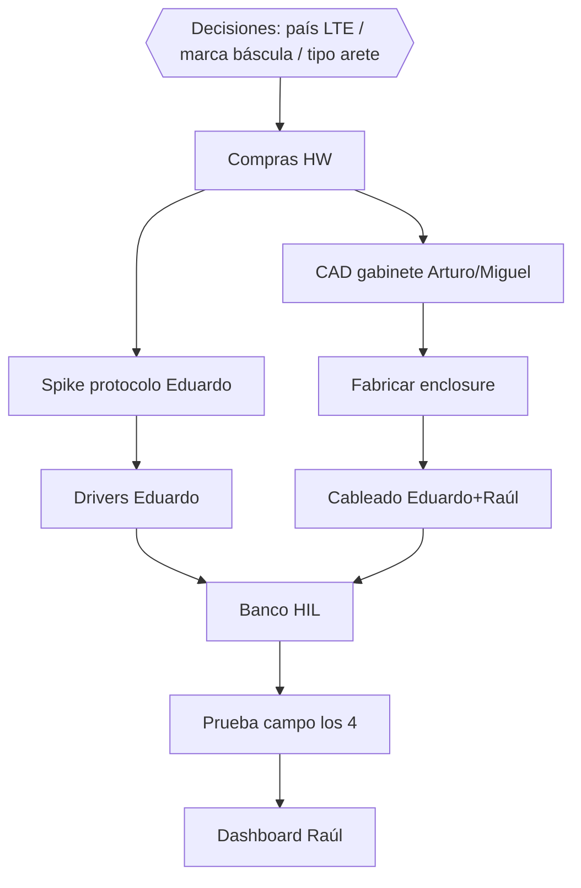

# Plan de equipo — 4 personas (epics y tareas)

Plan operativo para Fierro IoT con roles claros:

| Persona | Perfil | Dominio principal |
|---------|--------|-------------------|
| **Arturo** | Estudiante de mecánica | Gabinete, montajes, manga RFID, instalación |
| **Miguel** | Estudiante de mecánica | Misma área; pareja con Arturo |
| **Eduardo** | Ing. electrónico + programación | Edge (RPi, drivers, LTE, agent) |
| **Raúl** | Ing. electrónico + programación | Nube + PWA (API, DB, móvil) |

Cadencia: **sprints de 2 semanas**. Un ticket ≤ 2 días. Hardware y software **nunca** en el mismo ticket (ver [`agent/hardware-boundary.md`](agent/hardware-boundary.md)).

---

## 1. Cómo separar trabajo para Arturo y Miguel (mecánica)

### Lo que SÍ les corresponde (alto valor, aprendible, no bloquea software)

Los estudiantes de mecánica **no escriben Python/React ni configuran LTE**. Su producto es el **sistema físico** que hace viable la estación en el corral:

| Área | Por qué es mecánica | Entregable |
|------|---------------------|------------|
| Gabinete IP65 | Sellos, cortes, IP, condensación, sol | CAD + BOM + prototipo físico |
| Montaje RPi / HAT / UPS | Vibración, disipación, acceso a service | Placa de montaje / layout interno |
| Soporte antena RFID | Altura oreja, choque animal, ajustabilidad | Soporte regulable + dibujo de instalación |
| Integración a báscula 3.º | Interfaz mecánica a plataforma comercial | Brackets / pasacables / fijación |
| Tendido de cables | Strain relief, conduit, bucles de tierra físicos | Guía de cableado + ferrules |
| Ergonomía de manga | Flujo de ganado, seguridad, no trabar animales | Layout de estación en manga |
| Instrucciones de campo | El peón instala sin laptop | Manual A3 / checklist de montaje |
| BOM mecánico | Tornillería, empaquetaduras, perfiles | `hardware/enclosure/` + `hardware/bom/` |

### Lo que NO deben hacer (salvo apoyo puntual)

| Área | Dueño | Motivo |
|------|-------|--------|
| Drivers RS232 / protocolo indicador | Eduardo | Electrónica + software |
| Config Sixfab / APN / ECM | Eduardo | Redes / edge |
| Lógica outbox / API / PWA | Eduardo / Raúl | Software |
| Esquemático PCB / KiCad (cuando exista) | Eduardo + Raúl | Electrónica |
| Auth, Postgres, MQTT, OTA | Raúl (+ Eduardo) | Backend / infra |

### Cómo trabajan en pareja (mecánica)

| Rol rotativo | Responsabilidad |
|--------------|-----------------|
| **Lead diseño** (rota por sprint) | CAD, decisiones de montaje, DoD mecánico |
| **Lead campo / fab** | Compra, corte, prueba física, fotos de evidencia |

Siempre entregan juntos:

1. Archivos en `hardware/enclosure/` y `hardware/bom/` (cuando exista la carpeta).
2. Foto o video del montaje / prueba.
3. Ticket Jira + PR (aunque el PR sea solo docs/CAD/PDF).

### Interfaz con electrónicos (contrato de handoff)

```
Arturo/Miguel definen:  dimensiones, fijaciones, IP, altura antena, pasacables
Eduardo/Raúl definen:   conectores, consumo, puertos, disipación, señales de corte UPS
```

Reunión de handoff **30 min al inicio de cada sprint** y **al cerrar cada ticket mecánico** que afecte cableado.

---

## 2. Cómo se parten Eduardo y Raúl

| Persona | Foco | Evitar |
|---------|------|--------|
| **Eduardo** | `device-agent`, drivers, Sixfab, HIL, systemd en RPi | No monopolizar PWA |
| **Raúl** | `api`, DB, PWA, auth, CI, ingest | No monopolizar drivers |

Ambos revisan PRs del otro. Spikes de protocolo de báscula: **Eduardo lead**, Raúl apoyo en fixtures.

---

## 3. Mapa de epics


| Epic | Objetivo demostrable | Dueños |
|------|----------------------|--------|
| **E0** | Cerrar base software + CI + auth mínima | Eduardo, Raúl |
| **E1** | 1 estación real captura y sincroniza | Los 4 |
| **E2** | Cero pérdida con caos LTE + captura estable | Los 4 |
| **E3** | PWA usable en rancho (historial, alertas) | Raúl lead; Eduardo edge |
| **E4** | Flota: OTA, métricas, SLOs | Eduardo + Raúl; mecánica en producción enclosure |

---

## 4. Epic E0 — Cerrar base (1 sprint o menos)

**Objetivo:** repo listo para prototipo físico sin deuda que bloquee campo.

### Tareas software

| ID | Tipo | Título | Owner | Est. | Depende |
|----|------|--------|-------|------|---------|
| E0-T1 | Task | CI GitHub Actions: ruff + pytest + pnpm lint/build | Raúl | 1 d | — |
| E0-T2 | Task | Auth API: API key por device | Raúl | 1–2 d | — |
| E0-T3 | Task | Heartbeat: reportar `agent_version` + espacio disco | Eduardo | 0.5 d | — |
| E0-T4 | Task | Crear árbol `hardware/` vacío + README de convenciones | Eduardo | 0.5 d | — |
| E0-T5 | Docs | Checklist de decisiones abiertas (LTE país, marca báscula, arete) | Todos | 0.5 d | — |

### Tareas mecánica (arranque temprano — no esperan drivers)

| ID | Tipo | Título | Owner | Est. | Depende |
|----|------|--------|-------|------|---------|
| E0-M1 | Spike | Relevamiento de gabinetes IP65 comerciales + dimensiones RPi/Sixfab/UPS | Arturo | 1 d | E0-T4 |
| E0-M2 | Spike | Visita / fotos de manga tipo: altura oreja, anchos, riesgos de choque | Miguel | 1 d | — |
| E0-M3 | Task | Sketch CAD v0 del layout interno (bandeja electrónica) | Arturo + Miguel | 1–2 d | E0-M1 |

**DoD E0:** CI verde en PR; API exige API key en ingest; carpeta `hardware/` existe; mecánica tiene sketch v0.

---

## 5. Epic E1 — Prototipo físico (1–3 estaciones)

**Objetivo:** *"Una estación real captura pesajes con báscula física y sincroniza por LTE."*

### 5.1 Sub-epic E1-HW — Mecánica y estación física

| ID | Tipo | Título | Owner | Est. | Labels |
|----|------|--------|-------|------|--------|
| E1-M1 | Task | Selección y compra gabinete IP65 + pasacables + empaquetaduras | Arturo | 1 d + lead time | `hardware`,`enclosure` |
| E1-M2 | Task | CAD layout interno: RPi, HAT, UPS, DIN rail / bandeja | Miguel | 2 d | `enclosure` |
| E1-M3 | Task | Fabricar / adaptar placa de montaje y fijaciones anti-vibración | Arturo + Miguel | 2 d | `enclosure` |
| E1-M4 | Task | Diseño soporte antena RFID regulable en altura (paso 5 cm) | Miguel | 2 d | `hardware` |
| E1-M5 | Task | Prototipo soporte RFID en taller (madera/metal) y prueba de impacto | Arturo | 2 d | `hardware` |
| E1-M6 | Task | Plan de pasacables y strain relief (serial + antena LTE + power) | Arturo | 1 d | `enclosure` |
| E1-M7 | Task | Integración mecánica a báscula comercial (brackets / no modificar celda) | Miguel | 1–2 d | `hardware` |
| E1-M8 | Docs | Manual de montaje en campo (pasos + fotos + torque) | Arturo + Miguel | 1 d | `docs` |
| E1-M9 | Task | BOM mecánico v1 con P/N y proveedores | Miguel | 1 d | `bom` |

**Criterios de aceptación mecánicos (E1):**

- [ ] Gabinete cerrado con electrónica fija; cables con strain relief
- [ ] Antena RFID montada a altura documentada; regulable
- [ ] Estación se puede instalar en manga sin soldar a la báscula de forma irreversible
- [ ] Manual A3 usable por alguien que no diseñó el CAD

### 5.2 Sub-epic E1-EE — Electrónica / edge

| ID | Tipo | Título | Owner | Est. | Labels |
|----|------|--------|-------|------|--------|
| E1-E1 | Spike | Documentar protocolo RS232 del indicador elegido (baud, framing, peso estable) | Eduardo | 1–2 d | `edge`,`spike` |
| E1-E2 | Task | Driver serial indicador → `HardwareBackend` | Eduardo | 2 d | `edge` |
| E1-E3 | Spike | Validar lector RFID panel (FDX-B/HDX) + formato tag | Eduardo | 1 d | `edge`,`spike` |
| E1-E4 | Task | Driver RFID serial + debounce básico | Eduardo | 1–2 d | `edge` |
| E1-E5 | Task | Sixfab LTE ECM/QMI + runbook por carrier | Eduardo | 2 d | `edge`,`infra` |
| E1-E6 | Task | Golden captures serial (fixtures) para CI | Eduardo | 1 d | `edge` |
| E1-E7 | Task | Banco HIL: 1 Pi + indicador + lector en oficina | Eduardo (+ Arturo montaje) | 1–2 d | `hardware`,`edge` |
| E1-E8 | Task | Cableado eléctrico: 12 V → buck/UPS → RPi; fusible; polaridad | Eduardo + Raúl | 1 d | `hardware` |

### 5.3 Sub-epic E1-SW — Nube / PWA ops

| ID | Tipo | Título | Owner | Est. | Labels |
|----|------|--------|-------|------|--------|
| E1-S1 | Task | Dashboard ops: cola `pending`, último heartbeat, versión | Raúl | 2 d | `web`,`api` |
| E1-S2 | Task | Endpoint/listado filtrable por `device_id` | Raúl | 1 d | `api` |
| E1-S3 | Task | Config device: `FIERRO_DEVICE_ID`, API key, URL en archivo de estación | Eduardo | 0.5 d | `edge` |
| E1-S4 | Task | Prueba campo: corte LTE → lecturas quedan pending → sync al volver | Eduardo + Raúl | 1 d | `edge` |

**DoD E1:** video de 1 vaca (o mock animal + hardware real) → lectura en PWA; corte de red no pierde eventos locales.

---

## 6. Epic E2 — Confiabilidad de captura

**Objetivo:** captura estable en manga real; caos no pierde datos.

### Mecánica

| ID | Título | Owner | Est. |
|----|--------|-------|------|
| E2-M1 | Ajuste de altura/ángulo RFID tras mediciones de tasa de lectura | Miguel + Eduardo | 2 d |
| E2-M2 | Blindaje / separación para lecturas cruzadas (dos animales) — barreras físicas | Arturo | 2 d |
| E2-M3 | Mejoras térmicas: sombra, ventilación, anti-condensación | Arturo + Miguel | 1–2 d |
| E2-M4 | Prueba de vibración / golpes en gabinete (checklist) | Miguel | 1 d |
| E2-M5 | Gabinete rev-B según fallas de campo | Arturo + Miguel | 2 d + lead time |

### Electrónica / software

| ID | Título | Owner | Est. |
|----|--------|-------|------|
| E2-E1 | Filtro peso estable (umbral + tiempo quieto) calibrable | Eduardo | 2 d |
| E2-E2 | Anti-doble lectura (tag window) parametrizable | Eduardo | 1 d |
| E2-E3 | Heartbeat: señal LTE, cola, temperatura, `hw_rev` | Eduardo | 1 d |
| E2-E4 | Suite chaos: reinicio mid-pesaje, LTE off, disco lleno | Eduardo + Raúl | 2 d |
| E2-S1 | Migrar API a Postgres | Raúl | 2 d |
| E2-S2 | Alertas básicas: device sin heartbeat > N min | Raúl | 1–2 d |

---

## 7. Epic E3 — Producto usable en rancho

**Objetivo:** el usuario del rancho usa la PWA en operación diaria.

### Mecánica (menor volumen; soporte a producción)

| ID | Título | Owner | Est. |
|----|--------|-------|------|
| E3-M1 | Kit de instalación estandarizado (bolsa de tornillería + plantilla) | Arturo + Miguel | 2 d |
| E3-M2 | Plantilla de posicionamiento RFID (jig) para 3 estaciones iguales | Miguel | 2 d |
| E3-M3 | Documentar tiempos de montaje (meta: < 2 h / estación) | Arturo | 1 d |

### Software

| ID | Título | Owner | Est. |
|----|--------|-------|------|
| E3-S1 | Multi-usuario / multi-rancho (tenancy básico) | Raúl | 2–3 d |
| E3-S2 | Historial por `tag_id` + gráfico ganancia | Raúl | 2 d |
| E3-S3 | Alertas push / email (cola alta, offline) | Raúl | 2 d |
| E3-E1 | Provisioning device (ID, keys, registro) | Eduardo | 2 d |
| E3-E2 | Spike MQTT vs HTTPS a escala (recomendación) | Eduardo + Raúl | 1 d |

---

## 8. Epic E4 — Flota

| ID | Título | Owner | Dominio |
|----|--------|-------|---------|
| E4-E1 | OTA A/B o paquetes firmados | Eduardo | edge |
| E4-S1 | Métricas: lag sync, uptime, tasa captura | Raúl | api/ops |
| E4-S2 | SLOs documentados + dashboard | Raúl | ops |
| E4-M1 | Enclosure producción (DFM, costo, proveedores) | Arturo + Miguel | mecánica |
| E4-E2 | Evaluación PCB carrier (solo si prototipo cableado ya validó) | Eduardo + Raúl | `pcb` |
| E4-M2 | Fit check mecánico de carrier en gabinete | Miguel | mecánica |

---

## 9. Matriz RACI (resumen)

| Actividad | Arturo | Miguel | Eduardo | Raúl |
|-----------|:------:|:------:|:-------:|:----:|
| CAD gabinete / montajes | **R** | **R** | C | I |
| Soporte RFID / manga | C | **R** | C | I |
| BOM mecánico | **R** | **A** | C | I |
| Drivers serial / HAL | I | I | **R/A** | C |
| Sixfab LTE | I | I | **R/A** | C |
| API / DB / auth | I | I | C | **R/A** |
| PWA | I | I | C | **R/A** |
| Pruebas de campo estación | **R** | **R** | **R** | C |
| CI / repo | I | I | C | **R** |

**R** = Responsible · **A** = Accountable · **C** = Consulted · **I** = Informed

---

## 10. Dependencias críticas (orden)



Sin las **decisiones abiertas** (país, marca indicador, aretes), E1 se atasca. Resolverlas en la primera semana.

---

## 11. Qué hace cada persona en la primera semana (concreto)

### Arturo
1. Spike gabinetes IP65 + medidas (E0-M1)
2. Sketch CAD layout interno (E0-M3)
3. Lista de compra mecánica (tornillos, pasacables, perfiles)

### Miguel
1. Relevamiento manga / altura oreja (E0-M2)
2. Conceptos de soporte RFID regulable (inicio E1-M4)
3. Fotos y croquis de instalación

### Eduardo
1. CI apoyo + `hardware/` tree (E0-T3/T4)
2. Conseguir manual del indicador / Spike protocolo (E1-E1) en cuanto haya marca
3. Preparar imagen RPi + Sixfab lab

### Raúl
1. CI GitHub Actions (E0-T1)
2. API key auth (E0-T2)
3. Boceto UI ops (cola pending) (prep E1-S1)

---

## 12. Definition of Done por tipo de ticket

| Tipo | DoD extra |
|------|-----------|
| Mecánica | CAD o foto + BOM actualizado + checklist de montaje tocado si cambió |
| Edge | pytest + fixture serial si hay driver; no romper outbox |
| API/Web | pytest / lint / build; evidencia curl o screenshot |
| Spike | Documento de hallazgos + decisión o ticket siguiente |

---

## 13. Capacidad sugerida por sprint (2 semanas)

| Persona | Capacidad neta (~) | Reserva |
|---------|-------------------|---------|
| Arturo | 6–8 días-tarea | 20% buffer fab/compras |
| Miguel | 6–8 días-tarea | 20% buffer fab/compras |
| Eduardo | 7–9 días-tarea | 15% incidents HIL |
| Raúl | 7–9 días-tarea | 15% CI/prod |

**Lead times de compra** (gabinete, lector, Sixfab, báscula) se planifican **un sprint antes** de necesitarlos en campo.

---

## 14. Riesgos de roles mal asignados (evitar)

| Mal patrón | Por qué duele | Corrección |
|------------|---------------|------------|
| Poner a Arturo/Miguel a “aprender React” para avanzar | Pierden el valor mecánico; E1 se atrasa | Mantenerlos en enclosure/RFID mount |
| Pedir a mecánica que “arme el driver” | No es su formación; genera deuda | Eduardo + fixtures |
| Software espera gabinete para codear | Viola HAL | Mock + HIL en paralelo |
| Un solo dueño de todo el edge y la nube | Cuello de botella | Split Eduardo / Raúl |

---

## Relacionados

- [`end-to-end.md`](end-to-end.md) — diagramas de flujo
- [`architecture.md`](architecture.md) — BOM y arquitectura
- [`agent/sprints.md`](agent/sprints.md) — cadencia y DoR/DoD
- [`agent/hardware-boundary.md`](agent/hardware-boundary.md) — frontera HW/SW
- [`agent/jira.md`](agent/jira.md) — plantillas de tickets
